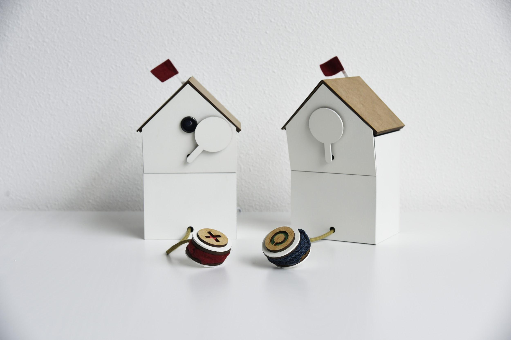
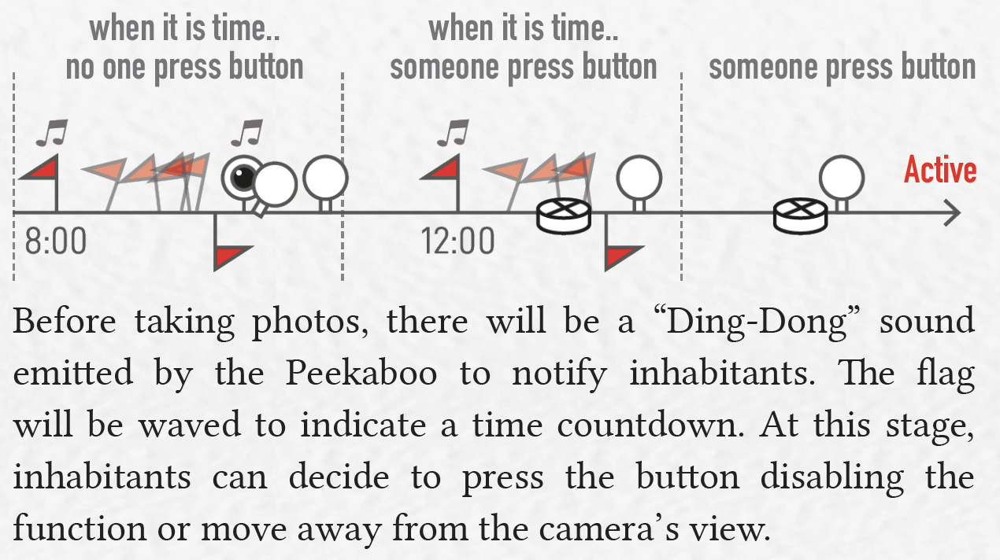
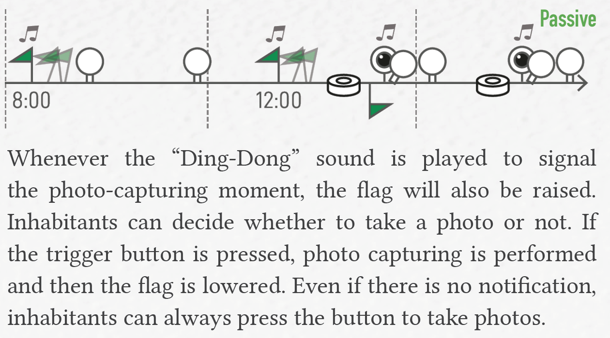
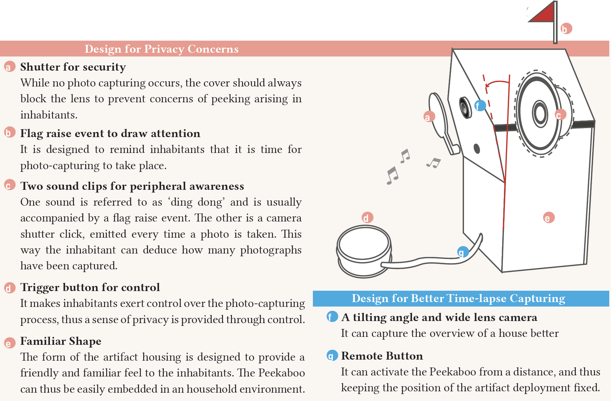
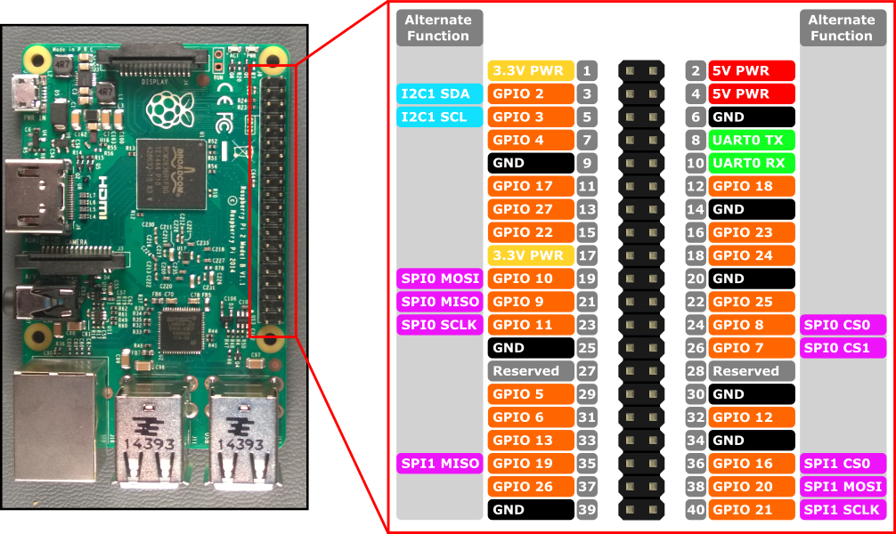
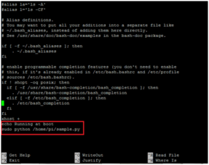

# PeekabooCam

Peekaboo Cam is an observational camera equipped with a coverable lens
and a button for photo-taking. This is the open-source repository for the Peekaboo cam design. You can find instructions how to build or further develop the Peekaboo cam below.

## Publication

We publish this open-source design as a companion to the [DIS 2019 pictorial](https://dl.acm.org/citation.cfm?id=3323699). The pictorial is a great read/browse/ponder and introduces why we designed Peekaboo, how we did it and what the first results of deploying were.

Please cite the pictorial as: 

	inproceedings{Cheng:2019:PCD:3322276.3323699,
	author = {Cheng, Yu-Ting and Funk, Mathias and Tsai, Wenn-Chieh and Chen, Lin-Lin},
	title = {Peekaboo Cam: Designing an Observational Camera for Home Ecologies Concerning Privacy},
	booktitle = {Proceedings of the 2019 on Designing Interactive Systems Conference},
	series = {DIS '19},
	year = {2019},
	isbn = {978-1-4503-5850-7},
	location = {San Diego, CA, USA},
	pages = {823--836},
	numpages = {14},
	url = {http://doi.acm.org/10.1145/3322276.3323699},
	doi = {10.1145/3322276.3323699},
	acmid = {3323699},
	publisher = {ACM},
	address = {New York, NY, USA},
	keywords = {ecology of daily objects, home ethnography, observational camera, privacy, research product},
	}

## Interaction Features

### The Active Peekaboo

*is an enthusiastic camera, taking photos automatically unless someone
press the button to stop it.*

Before taking photos, there will be a "Ding-Dong" sound emitted by the
Peekaboo to notify inhabitants. The flag will be waved to indicate a
time countdown. At this stage, inhabitants can decide to press the
button disabling the function or move away from the camera's view.

### The Passive Peekaboo

*is a lazy camera, only takes photos when someone press the button.*

Whenever the "Ding-Dong" sound is played to signal the photo-capturing
moment, the flag will also be raised. Inhabitants can decide whether to
take a photo or not. If the trigger button is pressed, photo capturing
is performed and then the flag is lowered. Even if there is no
notification, inhabitants can always press the button to take photos.

## Physical Features

The coverable lens is designed for preventing the leakage of personal
information, and providing the security by visualising the state of the
camera.

The button is designed for protecting personal privacy by providing
manual control for people.

----

## How to build a Peekaboo cam

### Physical Materials (laser cut)

Box for main structure:
[lasercut/peekaboo_box_3mm_mdf.ai](lasercut/peekaboo_box_3mm_mdf.ai)

The wall and rooftop to beautify the house
[lasercut/peekaboo_wall_rooftop_2mm_mdf.ai](lasercut/peekaboo_wall_rooftop_2mm_mdf.ai)

Coverable shutter and flag stick
[lasercut/peekaboo_gadget_cover_flag_button_2mm_mdf.ai](lasercut/peekaboo_gadget_cover_flag_button_2mm_mdf.ai)

### Electronics and components

* 1 Raspberry Pi 3 model B or 3 model B+ (note 1)
* 1 Raspberry Pi Compatible Camera 5MP V1.3
* 1 Raspberry Pi Wide Lens
* 1 Raspberry Pi Micro USB Power Supply - 5.1V 2.5A (1A won't work)
* 1 Push Button
* 1 Switch Button (for switching active and passive mode)
* 2 Servo Motors
* 1 [Audio Amplifier (PAM8403)](./assets/image2.jpg)
* 2 Speakers 2W, 45mm
* 1 mini breadboard

### Environmental Setting for Pi

We assume that you have acquired an SD card with the latest Raspbian operating system for your Raspberry Pi. The following steps can be executed either from a remote terminal (connect via SSH) or by connecting display, keybopard and mouse and directly working on the Raspberry Pi. After booting the Pi, open the command line and go:

Update the Pi to the newest software

	sudo apt-get update

	sudo apt-get upgrade

Configuring GPIO

	sudo apt-get update && sudo apt-get install python-rpi.gpio python3-rpi.gpio

Install pygame

	sudo pip3 install pygame

Install pigpio

	sudo apt-get install pigpio

Run pigpiod on the boot (the pigpen daemon is super important. without this, pigpio won't run）

	sudo systemctl enable pigpiod
(will enable it to auto-start on boot)

	sudo systemctl start pigpiod
(will start it immediately)

	sudo pigpiod

If you change your mind,

	sudo systemctl disable pigpiod
will undo the start-up behaviour.

	sudo systemctl stop pigpiod
will have an immediate effect.

### Pi Camera Settings

Open the Raspberry Pi Configuration Tool from the main menu: Ensure the camera software (the 5MP camera requires legacy camera support [here](https://www.raspberrypi.com/documentation/accessories/camera.html)) is enabled: If it's not enabled, enable it and reboot your Pi to begin. Instructions [here](https://projects.raspberrypi.org/en/projects/getting-started-with-picamera/4).

### Testing Pi Camera Module

To take a still photo, type in this command:

	raspistill -o testshot.jpg

Memory settings

	sudo raspi-config
select: 4 Performance options -\> P2 GPU Memory -\> and set at least 128MB

Some users report this message disappearing after changing the GPU
memory allotment to 256MB from 128MB.

Open the terminal at the boot

To auto-start the terminal on boot, open this file with nano:

	sudo nano /etc/xdg/lxsession/LXDE-pi/autostart

Add this line to the end of the file:

	@lxterminal

Save with CTRL-O and ENTER, close with CTRL-X and reboot with:

	sudo reboot

### Connect to the GPIO pins

(on Pi)

5V:

Servo motor for Flag to **pin 5**

Servo motor for Coverable Shutter to **pin 15**

3V:

Slide switch to **pin 16**

Push Button to **pin 3**

## Install and configure the main control software

Create a folder for the software

	mkdir /home/pi/timelapse

Copy the contents of the code directory on GitHub to the Pi:

Python scripts

* peekaboo.py (the main script to control everything)
* raiseflag.py (notification / control the flag)
* cameraclick.py (play the shutter sound camera.mp3)
* playsound.py (play the notification sound dingdong.mp3)
* mode_a.py (Passive mode)
* mode_b.py (Active mode)
* peekaboolooger.py (logs how users interact with the Peekaboo)
* peekaboologger.log (will be created automatically and logs all operations)

Sounds

* sounds/Camera.mp3
* sounds/dingdong.mp3

Auto run the peekaboo.py on the boot

	sudo nano /home/pi/.bashrc

Go to the last line of the script and add:

	echo Running at boot
	sudo python timelapse/peekaboo.py

Reboot the Pi to test if everything is working

	sudo reboot

Cron Job: Scheduling the notification time

	sudo crontab -e

	0 12 * * * python /home/pi/timelapse/peekaboo.py
	1 12 * * * python /home/pi/timelapse/raiseflag.py

Each schedule should run two python scripts.

If the switch button is in **mode a**, peekaboo.py will run mode_a.py, and raiseflag.py.
If the switch button is in **mode b**, peekaboo.py will run the mode_b.py, but the raiseflag.py will stop.
